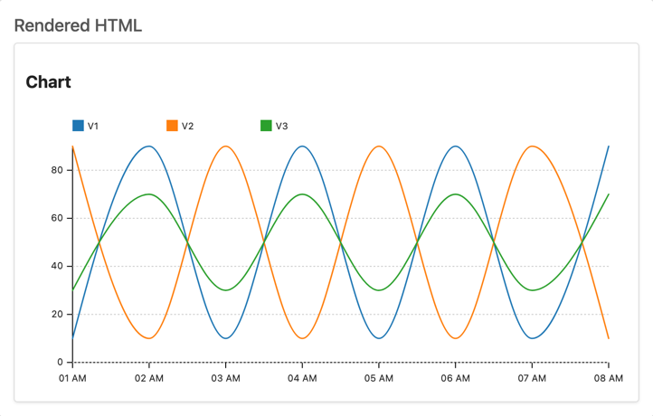
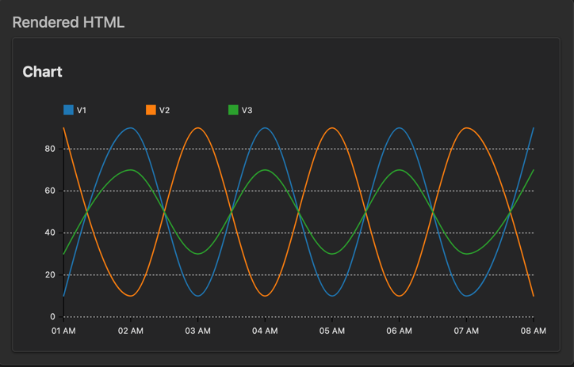

# rehype-timeseries-chart

[](https://www.npmjs.com/package/rehype-timeseries-chart)
[](LICENSE)

**[rehype](https://github.com/rehypejs/rehype)** plugin to transform CSV data into responsive SVG timeseries charts.

<table>
  <tr>
    <td align="center"><strong>Light theme</strong></td>
    <td align="center"><strong>Dark theme</strong></td>
  </tr>
  <tr>
    <td></td>
    <td></td>
  </tr>
</table>

## Contents

- [What is this?](#what-is-this)
- [When should I use this?](#when-should-i-use-this)
- [Install](#install)
- [Use](#use)
- [API](#api)
- [Examples](#examples)
- [Compatibility](#compatibility)
- [Security](#security)
- [Related](#related)
- [Contribute](#contribute)
- [License](#license)

## What is this?

This package is a [rehype](https://github.com/rehypejs/rehype) plugin that transforms CSV data in fenced code blocks into responsive SVG timeseries charts. It's built for documentation sites, blogs, and any content pipeline where you want to embed lightweight data visualizations without external dependencies.

## When should I use this?

Use this plugin when you:

- Want to embed simple, lightweight data visualizations in Markdown
- Are building documentation sites with tools like MDX, Docusaurus, or Next.js
- Need server-side rendering of charts without client-side JavaScript
- Want to convert CSV data from LLM responses into visual charts ([LibreChat](https://github.com/danny-avila/LibreChat))
- Prefer static SVG charts over complex interactive charting libraries

Don't use this plugin when you need advanced interactions like tooltips, zooming, or real-time data updates. For those cases, consider full JavaScript charting libraries like Chart.js or D3.

## Install

This package is [ESM only](https://gist.github.com/sindresorhus/a39789f98801d908bbc7ff3ecc99d99c).
In Node.js (version 18+), install with [npm](https://docs.npmjs.com/cli/install):

```bash
npm install rehype-timeseries-chart
```

## Use

Say we have the following Markdown:

````markdown
### Chart
```csv
Date,V1,V2,V3
2025-01-01 01:00:00,10,90,30
2025-01-01 02:00:00,90,10,70
2025-01-01 03:00:00,10,90,30
2025-01-01 04:00:00,90,10,70
2025-01-01 05:00:00,10,90,30
2025-01-01 06:00:00,90,10,70
2025-01-01 07:00:00,10,90,30
2025-01-01 08:00:00,90,10,70
```
````

…now running `node example.js` yields:

```html
<div class="timeseries-chart-container">
  <svg xmlns="http://www.w3.org/2000/svg" viewBox="0 0 640 300" preserveAspectRatio="none" width="100%" height="100%">
    <!-- SVG chart content -->
  </svg>
</div>
```

### Integration with remark

To use with remark (for Markdown processing):

```js
import { unified } from 'unified'
import remarkParse from 'remark-parse'
import remarkRehype from 'remark-rehype'
import rehypeTimeseriesChart from 'rehype-timeseries-chart'
import rehypeStringify from 'rehype-stringify'

const file = await unified()
  .use(remarkParse)
  .use(remarkRehype)
  .use(rehypeTimeseriesChart, {
    title: 'Sales Performance',
    textColor: 'var(--text-primary)',
    backgroundColor: 'var(--background-secondary)'
  })
  .use(rehypeStringify)
  .process(`# Sales Report

\`\`\`csv
Date,Revenue,Users
2024-01-01,1000,150
2024-02-01,1200,180
2024-03-01,1500,220
\`\`\``)

console.log(String(file))
```

## API

The default export is `rehypeTimeseriesChart`.

### `unified().use(rehypeTimeseriesChart,{...}])`

### Options

Configuration for the plugin (TypeScript type).

#### Fields

| Name              | Type      | Default                        | Description                                                 |
| ----------------- | --------- | ------------------------------ | ----------------------------------------------------------- |
| `width`           | `number`  | `640`                          | View‑box width of the generated SVG.                        |
| `height`          | `number`  | `300`                          | View‑box height of the generated SVG.                       |
| `title`           | `string`  | —                              | Optional chart title rendered above the plot.               |
| `textColor`       | `string`  | `"#000"`                       | CSS color for all text elements.                            |
| `backgroundColor` | `string`  | —                              | Fill color for the SVG background rectangle.                |
| `containerClass`  | `string`  | `"timeseries-chart-container"` | Class name for the wrapping `<div>`.                        |
| `codeLanguage`    | `string`  | `"csv"`                        | Which language class to look for on `<code>`.               |
| `saveOriginal`    | `boolean` | `false`                        | Keep the original `<pre><code>` block inside the container. |

## Examples

### Basic timeseries

````markdown
```csv
Date,Sales
2024-01-01,100
2024-02-01,150
2024-03-01,200
```
````

### Multiple series with custom styling

```js
.use(rehypeTimeseriesChart, {
  title: 'Q1 Performance Metrics',
  width: 800,
  height: 400,
  textColor: 'var(--text-primary)',
  backgroundColor: 'var(--bg-secondary)'
})
```

````markdown
```csv
Date,Revenue,Users,Conversion Rate
2024-01-01,1000,150,6.7
2024-02-01,1200,180,6.9
2024-03-01,1500,220,7.2
```
````

### Hourly data with a preserved original CSV code block

```js
.use(rehypeTimeseriesChart, {
  saveOriginal: true
})
```

````markdown
```csv
Timestamp,CPU Usage,Memory Usage
2024-01-01 00:00:00,45,2.1
2024-01-01 01:00:00,52,2.3
2024-01-01 02:00:00,38,1.9
```
````

## Compatibility

This package is compatible with Node.js 18+.

## Security

This plugin transforms CSV data into SVG markup. The plugin does not execute arbitrary code, but ensures any CSV data is from trusted sources as values are rendered verbatim in the generated HTML.

## Related

* [`rehype-graphviz-diagram`](https://github.com/PrinOrange/rehype-graphviz-diagram)
  — render Graphviz diagrams as SVG
* [`rehype-inline-svg`](https://github.com/JS-DevTools/rehype-inline-svg)
  — inline and optimize SVG images
* [`rehype-svgo`](https://github.com/TomerAberbach/rehype-svgo)
  — optimize inline SVGs using [SVGO](https://github.com/svg/svgo)
* [`rehype-mermaidjs`](https://github.com/remcohaszing/rehype-mermaidjs)
  — render mermaid diagrams

## LibreChat integration:


## Contribute

Yes, please!

## License

[MIT](LICENSE) © [Denis Perov](https://github.com/your-username)

<!-- Definitions -->

[npm]: https://docs.npmjs.com/cli/install
[esm]: https://gist.github.com/sindresorhus/a39789f98801d908bbc7ff3ecc99d99c
[esmsh]: https://esm.sh
[typescript]: https://www.typescriptlang.org
[rehype]: https://github.com/rehypejs/rehype
[unified]: https://github.com/unifiedjs/unified
